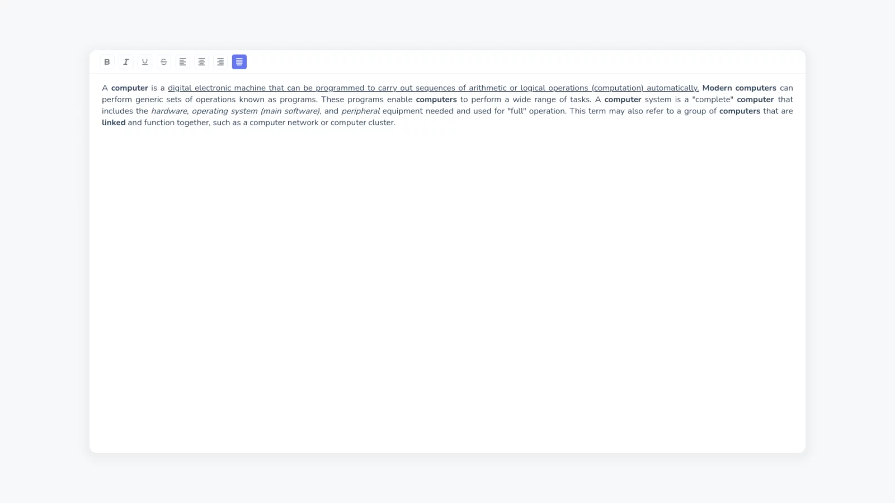

## About Project



Live simple word processing application. What You See Is What You Get (WYSIWYG). In addition, this application can work offline (PWA).

[Demo App](https://herdianurdin.github.io/simple-wysiwyg/)

### Built With

[](https://reactjs.org/)

## Getting Started

### Prerequisites

```sh
npm install npm@latest -g
```

### Installation

1. Clone the repo

```sh
git clone https://github.com/herdianurdin/simple-wysiwyg.git
```

2. Install NPM packages

```sh
npm install
```

## Usage

### Run Project

```sh
npm run start
```

### Build Project

```sh
npm run build
```

## License

Distributed under the GPL-3.0 License. See [LICENSE](LICENSE) for more information.
